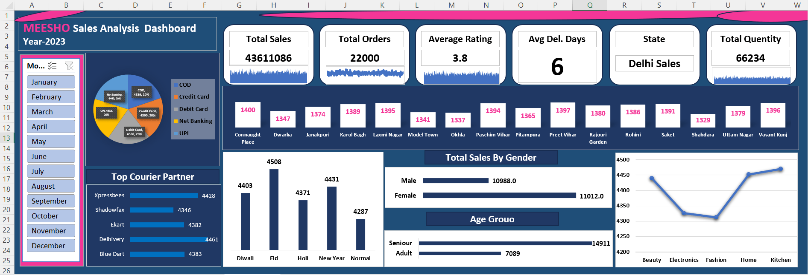

# 📊 Meesho Sales Analysis Dashboard

## 🚀 Project Overview
This project presents a complete sales analysis dashboard for Meesho's 2023 sales data using Microsoft Excel.

The dashboard helps analyze:
- Sales Performance
- Customer Behavior
- Festival Sales Trends
- Courier Performance
- Locality-wise Orders
- Category Performance
- Delivery Analysis

---

# 🛠️ Tools & Technologies Used

- Microsoft Excel
- Pivot Tables
- Pivot Charts
- Slicers
- Data Cleaning
- Dashboard Design

---

# 📈 Dashboard Features

✅ Interactive Dashboard  
✅ Dynamic Charts  
✅ KPI Cards  
✅ Festival-wise Sales Analysis  
✅ Gender-wise Customer Analysis  
✅ Courier Partner Performance  
✅ Area-wise Order Tracking  
✅ Category Performance Monitoring  

---

# 📷 Dashboard Preview



---

# 📌 Key Business Insights

### 🔹 Customer Insights
- Female customers generated slightly higher sales compared to male customers.

### 🔹 Festival Performance
- Eid festival recorded the highest sales among all events.

### 🔹 Area-wise Analysis
- Connaught Place achieved the highest order volume.
- Shahdara showed the lowest performance.

### 🔹 Product Category Insights
- Home & Kitchen category performed the best.
- Fashion category showed comparatively lower sales.

### 🔹 Delivery Performance
- Average delivery time remained around 6 days.

### 🔹 Courier Analysis
- Xpressbees handled the maximum deliveries efficiently.

---

# 📂 Project Structure

```bash
Meesho-Sales-Analysis-Dashboard
│
├── Dashboard Screenshot
│   └── dashboard.png
│
├── Dataset
│   └── meesho_sales_2023.xlsx
│
├── Insights
│   └── business_insights.txt
│
└── README.md
```

---

# 🎯 Project Objective

The main objective of this project is to:
- Analyze sales performance
- Identify customer trends
- Understand business growth opportunities
- Create a professional Excel dashboard for business reporting

---

# 👨‍💻 Author

## Sambhav Singh

📌 Aspiring Data Analyst  
📌 Skilled in Excel, SQL, Power BI & Dashboard Design  

---

# ⭐ If you liked this project

Give this repository a ⭐ on GitHub.
